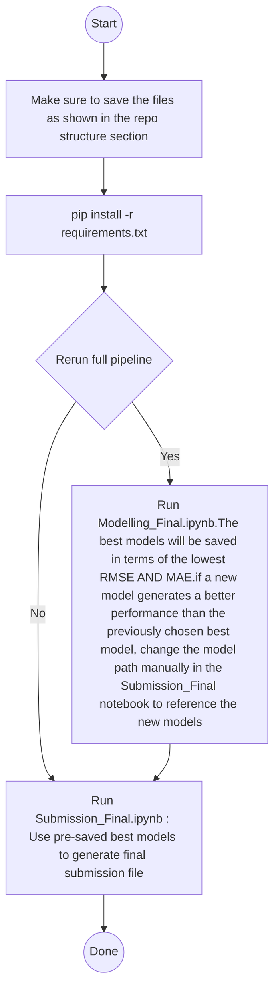

# Zindi-Maize-Price-Prediction-Challenge
Using historical prices of dry maize in Kenya, this project develops a machine learning solution to predict average weekly prices of maize in the counties of Kiambu, Kirinyaga, Mombasa, Nairobi and Uasin-Gishu.

## REPOSITORY LAYOUT
```
.
├── Modelling_Final.ipynb
├── data/
│   ├── agriBORA_maize_prices.csv
│   ├── agriBORA_maize_prices_weeks_46_to_51.csv
│   ├── kamis_maize_prices.csv
│   └── (optional) kamis_maize_prices_downloaded.csv
└── modelling_results/
    └── <exp_code>/   # run artifacts (if you choose to save models)
```
The notebook creates a run-specific experiment code (`exp_code`) and uses it to build `OUTPUT_DIR`.

## HOW TO RUN THE CODE
1. Maintain the structure above to run the code efficiently
2. Run 'pip install -r requirements.txt' (since we are using colab, each notebook has this code at the top before any imports).
3. To run the model from scratch, use Modelling_Final.ipynb
** For reproducibility, the artefacts from (3) are saved and we use the pre-saved models to generate the final submission file.

## ARCHITECTURAL DIAGRAM



## Data requirements

### AgriBORA inputs
The notebook expects at minimum:
- `Date` (parseable date)
- `County`
- `Commodity_Classification`
- `Wholesale` (used as the target price series)

It filters to:
- `COMMODITY_CLASS = "Dry_White_Maize"`
- `TARGET_COUNTIES = ["Kiambu", "Kirinyaga", "Mombasa", "Nairobi", "Uasin-Gishu"]`

### KAMIS inputs
The cleaned KAMIS file is expected to contain (case-insensitive; notebook lowercases columns):
- `date`
- `county`
- `classification` (used to select `White_Maize`)
- `retail`, `wholesale`
- `supplyvolume`

## Configuration knobs (top of notebook)

Key settings you can edit:

- **Paths**
  - `INPUT_DIR`, `AGRIBORA_FULL_PATH`, `AGRIBORA_RECENT_PATH`, `KAMIS_PATH`

- **Forecast**
  - `FORECAST_DATES` (week-start Mondays)
  - `ANCHOR_DATE` (last observed week used as the forecast base)

- **Backtesting**
  - `N_BACKTEST_CUTOFFS` (number of cutoffs to test)
  - `H_MAX` (how far to extend the weekly grid)

- **Model selection**
  - `best_models = {1: "catboost", 2: "mlp"}` (example in the notebook)

## Models implemented

The benchmark compares these model types:

- `catboost` — `CatBoostRegressor` (handles `county` as categorical via `cat_features`)
- `hgb` — `HistGradientBoostingRegressor`
- `ridge` — `Ridge` with preprocessing (impute + one-hot for `county` + optional scaling)
- `elasticnet` — `ElasticNet` with preprocessing (available in helper, not always benchmarked)
- `mlp` — `MLPRegressor` with preprocessing (impute + one-hot + scaling)

Feature selection is intentionally simple and is controlled via:
- `get_default_feature_spec(df)`

## Notes on the delta (change) target

The notebook forecasts **price changes** (deltas) instead of raw prices to make the learning problem more stable:
- Prices can have level shifts across counties and time.
- Predicting changes focuses the model on **short-horizon dynamics**.
- The final price forecast is reconstructed by adding the predicted change to the last known price at the anchor.

## Submission file (template)

The notebook includes commented code to create a submission DataFrame like:

- `ID`: `"{County}_Week_{wk}"`
- `Target_RMSE`: predicted price
- `Target_MAE`: predicted price

## Optional: NASA POWER weather features

NASA POWER extraction utilities are present but commented out:
- Fetch daily point data per county centroid
- Aggregate to weekly (sum/mean/min/max depending on variable)
- Merge on `(county, week_start_date)`
- Optionally create lagged versions of POWER columns

To enable this, uncomment:
- the centroid table
- the NASA POWER fetch/aggregate functions
- the merge into `ag_feat`

## Reproducibility

- Random seed is set via `RANDOM_SEED = 42`.
- Most sklearn models use `random_state=42`.
- CatBoost uses `random_seed=42`.
