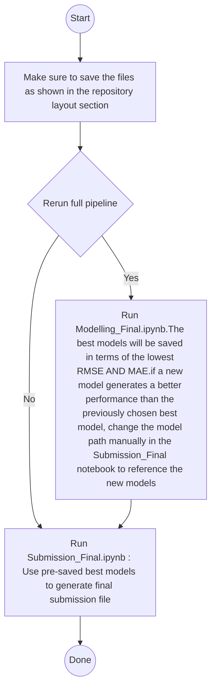

# Zindi-Maize-Price-Prediction-Challenge
## OVERVIEW
Using historical prices of dry maize in Kenya, this project develops a machine learning solution to predict average weekly prices of maize in the counties of Kiambu, Kirinyaga, Mombasa, Nairobi and Uasin-Gishu. By forecasting average weekly dry maize prices, the models aim to provide short-horizon market intelligence that can help farmers decide when to sell after storing produce in certified warehouses. Reliable two-week-ahead forecasts strengthen agriBORA’s storage–credit–market workflow by enabling better timing decisions for delayed selling and improving expected returns.

## Objectives

1. **Build a clean weekly panel** (county × week-start date) from the challenge data, robust to duplicate rows and irregular reporting.
2. **Improve signal** by augmenting AgriBORA prices with external market indicators from **KAMIS** (county + national summaries).
3. **Forecast multiple horizons** by training separate models for **H=1** and **H=2** weeks ahead.
4. **Select the best model per horizon** using a **walk-forward backtest** and competition-aligned metrics (**RMSE** and **MAE** on price level).
5. **Operationalize the output** so it can be rerun when data updates and exported into the competition submission format.


## REPOSITORY LAYOUT
```
.
├── Modelling_Final.ipynb
├── Submission_Final.ipynb
├── README.md
├── requirements.txt
├── data/
│   ├── agriBORA_maize_prices.csv
│   ├── agriBORA_maize_prices_weeks_46_to_51.csv
│   ├── kamis_maize_prices.csv
│   └── (optional) kamis_maize_prices_downloaded.csv
│   └──  processed_data.csv
└── modelling_results/
    └── <exp_code>/   # run artifacts (if you choose to save models)
```
The notebook creates a run-specific experiment code (`exp_code`) and uses it to build `OUTPUT_DIR`.

## CODING ENVIRONMENT
Google Colab (Free version) : The google drive is mounted at the start of each notebook. The main directory path is : "/content/drive/MyDrive/Zindi_Maize_Prediction_Challenge/"

## HOW TO RUN THE CODE
1. Maintain the structure above to run the code efficiently
2. Run 'pip install -r requirements.txt' (since we are using colab, each notebook has this code at the top before any imports).
3. To run the model from scratch, use Modelling_Final.ipynb
    - ** For reproducibility, the artefacts from (3) are saved and we use the pre-saved models to generate the final submission file.

## NOTEBOOK RUNTIME
All the notebook files takes less that 5 minutes when run on the colab environment

## ARCHITECTURAL DIAGRAM


## DATA REQUIREMENTS

### AgriBORA inputs
The notebook expects at minimum:
- `Date` (parseable date)
- `County`
- `Commodity_Classification`
- `Wholesale` (used as the target price series)

It filters to:
- `COMMODITY_CLASS = "Dry_White_Maize"`
- `TARGET_COUNTIES = ["Kiambu", "Kirinyaga", "Mombasa", "Nairobi", "Uasin-Gishu"]`

### KAMIS inputs
The cleaned KAMIS file is expected to contain (case-insensitive; notebook lowercases columns):
- `date`
- `county`
- `classification` (used to select `White_Maize`)
- `retail`, `wholesale`
- `supplyvolume`

## Configuration knobs

Key settings:

- **Paths**
  - `INPUT_DIR`, `AGRIBORA_FULL_PATH`, `AGRIBORA_RECENT_PATH`, `KAMIS_PATH`

- **Forecast**
  - `FORECAST_DATES` (week-start Mondays)
  - `ANCHOR_DATE` (last observed week used as the forecast base)

- **Backtesting**
  - `N_BACKTEST_CUTOFFS` (number of cutoffs to test)
  - `H_MAX` (how far to extend the weekly grid)
 
## ETL PROCESS
### 1) Ingest sources
- **AgriBORA (main data):**  
  - `data/agriBORA_maize_prices.csv` (historical)  
  - `data/agriBORA_maize_prices_weeks_46_to_51.csv` (recent patch)
- **KAMIS (external market):**  
  - `data/kamis_maize_prices.csv` (baseline kamis data)  
  - *(optional)* live download → `data/kamis_maize_prices_downloaded.csv`
    
### 2) Filter + standardize
- Filter AgriBORA rows to:
  - `Commodity_Classification == "Dry_White_Maize"`
  - `County in TARGET_COUNTIES`
- Combine “full” + “recent patch”, then **deduplicate** by `(County, Date)` keeping the latest row.
- Lowercase columns and normalize county name keys.

### 3) Weekly alignment (no leakage)
- Convert all dates to **week-start Mondays** by subtracting the weekday offset. This ensures a consistent weekly timeline for both modelling and forecast dates.
  
### 4) KAMIS preprocessing + aggregation
- Combine `kamis_maize_prices.csv` with the optional freshly downloaded KAMIS extract (when available), then filter to:
  - `classification == "White_Maize"`
- Apply **outlier clipping by county** (1st–99th percentiles) on KAMIS wholesale before aggregating.
- Build weekly market summaries:
  - **County-level:** median wholesale/retail, sum supply volume
  - **National-level:** median wholesale/retail, sum supply volume
- Create **lag-1 features** (shift by one week) to prevent look-ahead bias.
  
### 5) Feature merge + fallback fill
- Merge lagged KAMIS features onto the AgriBORA weekly panel.
- If a **county KAMIS lag** is missing for a week, fall back to the **national lag** for that same week.
- Remaining missing KAMIS features (e.g., early history) are filled with `0.0` as a safe baseline.

## MODELLING APPROACH
### TARGET DEFINITION
Instead of predicting price directly, we predict the **price change (delta)**:
- `delta_h1 = price(t+1) - price(t)`
- `delta_h2 = price(t+2) - price(t)`
We forecast **price changes** (deltas) instead of raw prices to make the learning problem more stable:
- Prices can have level shifts across counties and time.
- Predicting changes focuses the model on **short-horizon dynamics**.

The final price forecast is then reconstructed by adding the predicted change to the last known price at the anchor.
- `price_hat(t+h) = price(t) + delta_hat_h`

This helps stabilize learning across counties with different price levels and keeps the model focused on the short-horizon dynamics.

### FEATURE SET
The training set is built from a compact, high-signal feature list:
- **Autoregressive / gap-aware from AgriBORA:** `prev_price`, `prev2_price`, `gap1_weeks`, `gap2_weeks`, `slope1`
- **Seasonality:** `iso_week`, `wk_sin`, `wk_cos`, `is_year_end`
- **External market (KAMIS, lag-1):**
  - national: `k_nat_wh_lag1`, `k_nat_rt_lag1`, `k_nat_supply_lag1`
  - county (with national fallback): `k_wh_lag1`, `k_rt_lag1`, `k_supply_lag1`
- **Categorical:** `county`

| Feature | Type | Source | Definition (how it’s computed) | Why it helps |
|---|---|---|---|---|
| `county` | categorical | AgriBORA | County identifier (Kiambu, Kirinyaga, Mombasa, Nairobi, Uasin-Gishu) | Captures structural price differences across locations |
| `wholesale` | numeric | AgriBORA | Current week’s observed wholesale price at time **t** | Baseline level used when reconstructing price from predicted delta |
| `prev_price` | numeric | AgriBORA | Previous observed wholesale price for that county | Autoregressive memory |
| `prev2_price` | numeric | AgriBORA | Second previous observed wholesale price | Longer memory / trend |
| `gap1_weeks` | numeric | AgriBORA | Weeks since the last observation | Handles irregular reporting / missing weeks |
| `gap2_weeks` | numeric | AgriBORA | Weeks since the 2nd last observation | Longer-gap context |
| `slope1` | numeric | AgriBORA | Normalized weekly change | Makes changes comparable even with missing weeks |
| `iso_week` | numeric | Calendar | ISO week-of-year for the week-start date | Captures seasonal patterns |
| `wk_sin` | numeric | Calendar | Cyclical encoding | Treats week 52 and week 1 as “close” |
| `wk_cos` | numeric | Calendar | Cyclical encoding | Companion to `wk_sin` for seasonality |
| `is_year_end` | numeric (0/1) | Calendar | 1 if `iso_week >= 48`, else 0 | Flags year-end effects |
| `k_nat_wh_lag1` | numeric | KAMIS (national) | Previous week’s **national** median wholesale price (lag-1) | External market signal |
| `k_nat_rt_lag1` | numeric | KAMIS (national) | Previous week’s **national** median retail price (lag-1) | External market signal |
| `k_nat_supply_lag1` | numeric | KAMIS (national) | Previous week’s **national** total supply volume (weekly sum, lag-1) | Supply pressure proxy |
| `k_wh_lag1` | numeric | KAMIS (county) | Previous week’s **county** median wholesale price (lag-1); if missing → `k_nat_wh_lag1` | County signal with national fallback |
| `k_rt_lag1` | numeric | KAMIS (county) | Previous week’s **county** median retail price (lag-1); if missing → `k_nat_rt_lag1` | County signal with national fallback |
| `k_supply_lag1` | numeric | KAMIS (county) | Previous week’s **county** supply volume (weekly sum, lag-1); if missing → `k_nat_supply_lag1` | County signal with national fallback |

**Notes**
- All KAMIS features are **lagged by 1 week** to prevent look-ahead bias.
- If county-level KAMIS lags are missing for a given week, the pipeline **falls back to national lag values**, then fills any remaining early-series missing values with `0.0`.

### Models benchmarked
For each horizon, the notebook benchmarks:
- **CatBoostRegressor** (county passed as categorical)
- **Ridge** (impute + one-hot encode + standardize numeric)
- **MLPRegressor** (impute + one-hot encode + standardize numeric)
- **HistGradientBoostingRegressor** (impute + one-hot encode; no scaling)

### Performance and model selection

Model selection is based on a **walk-forward backtest** (rolling origin):
- For each cutoff date, train on all weeks strictly before the cutoff and predict the cutoff week.
- Compute **RMSE** and **MAE** on the **reconstructed price level** (not on delta).

Backtest mean results:

**H = 1 (1-week ahead)**  
| model | RMSE | MAE |
|---|---:|---:|
| catboost | 2.0656 | 1.8313 |
| ridge | 2.1193 | 1.8821 |
| mlp | 2.3012 | 2.0549 |
| hgb | 2.3535 | 2.1315 |

✅ **Selected model (H=1): CatBoost** (lowest RMSE and MAE)

**H = 2 (2-weeks ahead)**  
| model | RMSE | MAE |
|---|---:|---:|
| mlp | 3.2015 | 3.0520 |
| hgb | 3.3586 | 3.2311 |
| catboost | 3.4372 | 3.2778 |
| ridge | 3.5102 | 3.3217 |

✅ **Selected model (H=2): MLP** (lowest RMSE and MAE)

Why it can differ by horizon:
- At **H=1**, short-term structure + non-linear effects are captured well by boosted trees (CatBoost).
- At **H=2**, the signal is weaker/noisier; in this run, the MLP generalized better across recent cutoffs.

### Feature Importance
Looking at the feature importance files:
    - Across both horizons, the most influential signal is the **current week wholesale price (`wholesale`)**, which is expected in short-horizon forecasting because recent price level acts as a strong anchor for near-term movements (the delta is typically smaller than the absolute level). The second major driver is **seasonality**—`iso_week` and the cyclical encodings (`wk_sin`, `wk_cos`)—indicating a consistent calendar pattern in weekly maize prices (e.g., harvest, storage, and end-of-year trading effects).  
    - **Location effects** are also important. In the H=1 CatBoost model this appears directly as `county`, while in the H=2 MLP model it appears as one-hot indicators (e.g., `county_Kiambu`, `county_Mombasa`). This suggests that counties have persistent structural differences (market access, demand/supply conditions, transport costs) that the model learns as a baseline shift.
    - Next, the model leverages **recent dynamics and irregular reporting structure** through lag/gap-aware features such as `prev_price`, `prev2_price`, `slope1`, and `gap1_weeks`. These help distinguish “normal” week-to-week changes from cases where the previous observation is further back (missing weeks), where the implied trend and uncertainty are different.
    - Finally, lagged external market indicators from **KAMIS** (e.g., `k_wh_lag1`, `k_rt_lag1`, `k_supply_lag1`, and national lags such as `k_nat_wh_lag1`) contribute additional predictive power, acting as a broader market context signal that complements the county’s own price history.


*Note:* Importance scores are **model-specific**. CatBoost importance reflects tree-based split/impact importance, while the MLP panel reflects a different importance proxy (in this case, permutation importance). Therefore, the rankings are most reliable **within each horizon/model** rather than as a direct numerical comparison across the two panels.

## Submission file (template)

The notebook includes commented code to create a submission DataFrame like:

- `ID`: `"{County}_Week_{wk}"`
- `Target_RMSE`: predicted price
- `Target_MAE`: predicted price

## Model Perfomrance on Test Data
| Scorboard | RMSE | MAE |
|---|---:|---:|
| Public | 4.150821 | 3.50060963 |
| Private | 1.247100007 | 0.794047626 |

## Lifecycle management

### Reproducibility

- Random seed is set via `RANDOM_SEED = 42`

### Updating data
- Drop new/updated AgriBORA extracts into `data/` (same schema), then rerun the notebook.
- To fresher KAMIS market signals, rerun the optional KAMIS download cell to regenerate `kamis_maize_prices_downloaded.csv`.

### Re-training and re-selecting models
- Re-run `backtest_compare(...)` for H=1 and H=2.
- If a different model becomes best, update your `best_models` mapping (and the model file path used by your submission notebook).

### Forecast schedule
- Update these top-of-notebook knobs when the competition horizon shifts:
  - `ANCHOR_DATE` (last observed week-start date used as the base)
  - `FORECAST_DATES` (target Monday dates to predict)
  - `H_MAX` (how far to extend the weekly grid)

### Run outputs / versioning
- Each run creates a timestamp-based `exp_code` and a matching output folder:
  - `modelling_results/<exp_code>/`
- If you enable model saving (`save_path=...`), keep one model per horizon (e.g., `catboost_delta_h1.joblib`, `mlp_delta_h2.joblib`) and update paths in the submission step accordingly.


## Optional: NASA POWER weather features
NASA POWER is a global meteorological dataset produced by NASA that provides daily, gridded weather variables such as temperature (min/max/mean), precipitation, solar radiation, humidity, wind speed, and related agro-climate indicators.
In this project, NASA POWER features were explored as optional exogenous signals by mapping each county to a representative location (e.g., centroid), extracting daily weather time series, and aggregating them to the same weekly (Monday-start) frequency as the price panel, with lagged versions to avoid look-ahead bias.
Although weather should theoretically affect maize supply conditions and market expectations, we ultimately excluded NASA POWER features in the final submission models because, in our backtests, adding them consistently reduced performance (higher RMSE/MAE).
This likely reflects a combination of (i) spatial mismatch between coarse grid weather and true production zones, (ii) timing mismatch between weekly price movements and slower agronomic response lags, and (iii) limited training history where additional noisy features increase variance.
Note on evaluation: We did not run an exhaustive feature subset search for NASA POWER (e.g., ablations, L1 selection, permutation selection). Instead, we added the full set of weekly aggregated POWER variables at once. The resulting degradation in RMSE/MAE therefore reflects this baseline integration and should be interpreted as evidence that “POWER-as-added” did not improve generalization in our backtests, not as a definitive statement that weather signals are uninformative.


